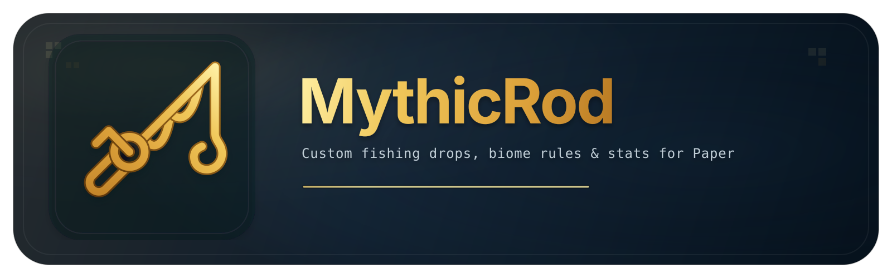

<div align="center">



<br/>

Weighted loot tables, biome filters, permission gates, an in-game drop
editor, statistics, and a small public API.

<br/>

<sub><b>Project</b></sub><br/>
[](https://github.com/xcutiboo/MythicRod/releases)
[](LICENSE)
[](https://papermc.io)
[](https://adoptium.net)
[](https://papermc.io/software/folia)

<sub><b>Downloads</b></sub><br/>
[](https://hangar.papermc.io/xcutiboo/MythicRod)
[](https://modrinth.com/plugin/mythicrod)
[](https://xcutiboo.github.io/MythicRod/)

<sub><b>Community</b></sub><br/>
[](https://discord.gg/MDwtUgxX9U)
[](https://crowdin.com/project/mythicrod)
[](https://ko-fi.com/xcutiboo)

<sub><b>Quality</b></sub><br/>
[](https://github.com/xcutiboo/MythicRod/actions/workflows/build.yml)
[](https://github.com/xcutiboo/MythicRod/actions/workflows/codeql.yml)
[](https://sonarcloud.io/project/overview?id=xcutiboo_MythicRod)

<sub><b>Live telemetry</b></sub><br/>
[](https://bstats.org/plugin/bukkit/MythicRod/31484)
[](https://bstats.org/plugin/bukkit/MythicRod/31484)

[Docs](https://xcutiboo.github.io/MythicRod/) ·
[Developer API](docs/developer-api.md) ·
[Changelog](CHANGELOG.md)

</div>


## Install

1. Grab `MythicRod-Paper-<version>.jar` from the
   [releases page](https://github.com/xcutiboo/MythicRod/releases).
2. Drop it in `plugins/`, start the server once.
3. Edit `plugins/MythicRod/config.yml` and `drops.yml`.
4. `/mythicrod reload`.

No extra runtime dependencies. Nexo is optional and only kicks in if you use
`nexo:*` identifiers in `drops.yml`.


## Version targets

- Plugin: `2026.1.0` (CalVer, year.release.patch).
- API: Paper `26.1.2` (`api-version: 26.1.2`).
- Java: 25+.
- Bundled languages: `en_US` (source) and `ja_JP`. The rest land through Crowdin.

Folia owner-thread handoffs are written into the scheduler, listener and
command paths. A live smoke test on Folia `26.1.2 build 8` covered the GUI,
drop rolls, statistics writes, language reload and `/mythicrod give`.
`/mythicrod status` reports `Runtime: Folia` when the plugin is running on
a Folia jar.

Spigot is **not** an active build target. The `mythicrod-spigot/` module
ships a stub jar that loads cleanly on a Spigot server and logs that Paper
is the supported runtime. No further work on Spigot is planned until there
is enough community interest or contributor support to justify a full
backport.


## Commands

Aliases: `/mr`, `/mrod`. Brigadier-registered so tab completion hides what
the sender can't run.

| Command | Purpose | Permission |
|---|---|---|
| `/mythicrod` / `/mythicrod gui` | Main GUI hub | `mythicrod.command` / `.gui` |
| `/mythicrod rod` | Visual + rod-tier settings | `mythicrod.gui` |
| `/mythicrod rod inspect` | Dump PDC for the held rod | `mythicrod.admin.debug` |
| `/mythicrod drops [category]` | Drop browser / category view | `mythicrod.drops.view` |
| `/mythicrod stats [player]` | View stats | `mythicrod.stats.view` (+ `.others`) |
| `/mythicrod stats reset <player>` | Wipe a player's stats | `mythicrod.admin.config` |
| `/mythicrod top [limit]` | Leaderboard | `mythicrod.stats.leaderboard` |
| `/mythicrod give <player> <tier>` | Give a MythicRod | `mythicrod.admin.give` |
| `/mythicrod config [setting] [value]` | Runtime toggles | `mythicrod.admin.config` |
| `/mythicrod particle [channel] <type>` | Particle config | `mythicrod.admin.config` |
| `/mythicrod validate` | Run a config health check | `mythicrod.admin.config` |
| `/mythicrod testroll [biome] [count]` | Simulate rolls + tier histogram | `mythicrod.admin.debug` |
| `/mythicrod reload` | Reload data atomically | `mythicrod.admin.reload` |
| `/mythicrod debug` | Console debug dump | `mythicrod.admin.debug` |
| `/mythicrod help` | Reference | `mythicrod.command` |

`/mythicrod give` inserts the rod on the target's owner scheduler, so it's
safe on Folia. `/mythicrod validate` flags unknown materials, weight/amount
out of range, missing Nexo, unknown enchantments and biome keys, and
permissions outside the `mythicrod.*` namespace. `/mythicrod testroll`
simulates the live drop table for up to 10,000 rolls and prints a tier
histogram with the five most-frequent identifiers.


## Permissions

| Node | Default | Purpose |
|---|---|---|
| `mythicrod.command` | `true` | Base command access |
| `mythicrod.gui` | `true` | Open the main GUI |
| `mythicrod.stats.view` | `true` | View your own stats |
| `mythicrod.stats.view.others` | `op` | View other players' stats |
| `mythicrod.stats.leaderboard` | `true` | View the leaderboard |
| `mythicrod.drops.view` | `true` | Browse drop tables |
| `mythicrod.drops.global` | `true` | Receive `global` drops |
| `mythicrod.drops.rare` | `op` | Receive `rare` drops |
| `mythicrod.drops.legendary` | `op` | Receive `legendary` drops |
| `mythicrod.rod.advanced` | `op` | Use the advanced rod tier |
| `mythicrod.rod.legendary` | `op` | Use the legendary rod tier |
| `mythicrod.admin.reload` | `op` | Reload runtime data |
| `mythicrod.admin.give` | `op` | Give MythicRod items |
| `mythicrod.admin.config` | `op` | Edit drops, config, stats reset |
| `mythicrod.admin.debug` | `op` | Run validate, testroll, rod inspect |

Grouped parents `mythicrod.*`, `mythicrod.admin.*`, `mythicrod.stats.*`,
`mythicrod.drops.*`, `mythicrod.rod.*` are declared in `paper-plugin.yml`.

Individual drop entries in `drops.yml` may also declare a `permission:`
field. The drop is filtered out for any player who doesn't hold that node.


## Configuration

Defaults shipped in `config.yml`:

```yaml
language:
  default: en_US

features:
  sounds:
    enabled: true
  particles:
    enabled: true
    catch-particle: SPLASH
    bubble-particle: BUBBLE_POP
    success-particle: HAPPY_VILLAGER
    xp-particle: HAPPY_VILLAGER
  statistics:
    enabled: true
  drops:
    biome-specific:
      enabled: true
    delivery-mode: vanilla_retrieve   # vanilla_retrieve | inventory | drop_at_player
  rods:
    luck-multipliers:
      basic: 1.0
      advanced: 1.25
      legendary: 1.5
  permissions:
    enabled: true
  debug:
    enabled: false

timers:
  stats-save-interval-seconds: 600

messages:
  catch:
    common:    '<gray>You caught <white><bold>{amount}x {item}</bold></white>!'
    uncommon:  '<green><bold>♦ Uncommon Catch ♦</bold></green>\n<dark_green>You caught <green><bold>{amount}x {item}</bold></green>!'
    rare:      '<aqua><bold>★ Rare Catch! ★</bold></aqua>\n<dark_aqua>You caught <aqua><bold>{amount}x {item}</bold></aqua>!'
    legendary: '<gold><bold>✨ LEGENDARY CATCH! ✨</bold></gold>\n<yellow>You caught <gold><bold>{amount}x {item}</bold></gold>!'
```

Notes:

- `weight` is a relative weight, not a percentage.
- Rod luck multipliers only affect drops with `weight <= 5`, i.e. the rare
  and legendary tiers.
- Invalid particle names fall back to safe defaults at load/reload with a
  console warning.
- Negative or zero weights and out-of-range amounts get clamped at load,
  again with a console warning that names the offending entry.


## Drop tables

```yaml
drops:
  global:
    - identifier: COD
      weight: 50
      amount: 1
    - identifier: SALMON
      weight: 30
      amount: 1
      custom_name: '<aqua>★ Silver Salmon</aqua>'
      lore:
        - '<gray>A shimmering silver catch'

  rare:
    - identifier: DIAMOND
      weight: 2
      amount: 1
      custom_name: '<aqua>Deep-Sea Diamond</aqua>'
      glow: true

  biome_ocean:
    - identifier: NAUTILUS_SHELL
      weight: 5
      amount: 1
      biomes:
        - minecraft:ocean
        - minecraft:deep_ocean
```

| Field | Type | Meaning |
|---|---|---|
| `identifier` | `String` | Material name, `minecraft:*`, or `nexo:*` (Nexo only) |
| `weight` | `int >= 1` | Relative roll weight |
| `amount` | `int 1..64` | Stack size |
| `custom_name` | `String` | MiniMessage display name |
| `lore` | `List<String>` | MiniMessage lore lines |
| `custom_model_data` | `int >= 0` | Custom model data |
| `glow` | `boolean` | Enchant glow without an actual enchant |
| `enchantments` | `Map<String, int>` | e.g. `minecraft:unbreaking: 2` |
| `item_flags` | `List<String>` | `HIDE_ENCHANTS`, etc. |
| `biomes` | `List<String>` | Restrict to specific biomes |
| `permission` | `String` | Permission node required to catch |

`biome_<name>` categories scope to the matching biome. `/mythicrod drops
ocean` resolves to `biome_ocean`. Implicit gates apply when
`features.permissions.enabled: true`: `global` -> `mythicrod.drops.global`,
`rare` -> `mythicrod.drops.rare`, `legendary` -> `mythicrod.drops.legendary`.


## Developer API

`mythicrod-api` holds the public surface. Internals are kept out of it.

| Use case | Type |
|---|---|
| Resolve MythicRod at runtime | `MythicRodAPI` via Bukkit `ServicesManager` or `MythicRodServices` |
| Inspect drop tables | `DropCatalog`, `PlatformDrop` |
| Create compatible items | `MythicRodAPI#createItem(...)` / `PlatformItemFactory` |
| Inject extra rewards | `ExternalDropProvider` |
| Stats / leaderboards | `PlayerStatSnapshot` futures from `MythicRodAPI` |
| React to reward flow | `MythicRodRewardRollEvent`, `MythicRodFishCatchEvent`, `MythicRodStatsUpdateEvent` |

```java
MythicRodAPI api = MythicRodServices.require();

api.registerExternalDropProvider(new ExternalDropProvider() {
  @Override public String getKey() { return "myplugin:special"; }
  @Override public double getWeight(PlatformPlayer p) {
    return p.hasPermission("myplugin.special") ? 2.5D : 0.0D;
  }
  @Override public PlatformItem generateItem(PlatformPlayer p) {
    return api.createItem("DIAMOND", 1).orElse(null);
  }
  @Override public String getDisplayName() { return "<aqua>Special Diamond</aqua>"; }
  @Override public String getTier() { return "rare"; }
});
```

Contract notes:

- Future-backed API methods (`getPlayerStats`, `getTopPlayers`,
  `flushAllStats`) complete on MythicRod's async scheduler. Reschedule back
  to the correct owner before touching world state.
- Provider hooks and Paper events run on the player-owned execution path
  (synchronous on Paper, region thread on Folia). Keep them non-blocking.
  If a provider takes >50 ms it gets named in the server log.
- Weights are relative weights, not percentages.

Full guide: [docs/developer-api.md](docs/developer-api.md).


## Localization

Translations are managed on Crowdin:
[crowdin.com/project/mythicrod](https://crowdin.com/project/mythicrod). The
GitHub action keeps source strings in sync and opens an `l10n: sync Crowdin
translations` PR when translations land.

To use a translation on your server:

1. Copy a `plugins/MythicRod/lang/<locale>.yml` from the repo or wait for
   one to ship in a release.
2. Set `language.default` in `config.yml`.
3. `/mythicrod reload`.

If you want to translate, please use Crowdin rather than editing files
directly. Direct file edits are accepted as a fallback but will be
overwritten the next time Crowdin syncs unless the same change exists in
Crowdin.


## Metrics

bStats pluginId `31484`. The custom chart set covers Folia detection,
server language, active profile, reward delivery mode, every feature
toggle, total configured drops and categories, tracked player count,
total custom catches, and per-category drop share. bStats startup
failures don't block the plugin from enabling.

[](https://bstats.org/plugin/bukkit/MythicRod/31484)


## Build from source

```bash
git clone https://github.com/xcutiboo/MythicRod.git
cd MythicRod
./gradlew :mythicrod-paper:shadowJar
```

Output: `mythicrod-paper/build/libs/MythicRod-Paper-<version>.jar`.

Repository layout:

```
mythicrod-api/      public API, service contracts, value objects
mythicrod-common/   shared drop logic, config, stats, text
mythicrod-paper/    Paper runtime, GUI, commands, events, adapters
```


## Releases

Tagged releases ship a SHA-256 file alongside each jar:

```bash
sha256sum -c MythicRod-Paper-2026.1.0.jar.sha256
```

`v*-rc*`, `v*-beta*`, `v*-alpha*`, and `v*-snapshot*` tags publish as
pre-releases automatically.


## Support

Bug reports and PRs are welcome. If you want me to keep adding features
(particularly the Spigot module and deeper Folia validation), the easiest
way to help is [Ko-fi](https://ko-fi.com/xcutiboo).


## License

MIT. See [LICENSE](LICENSE).
